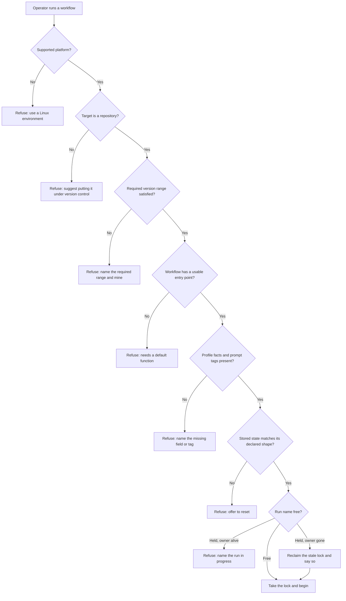
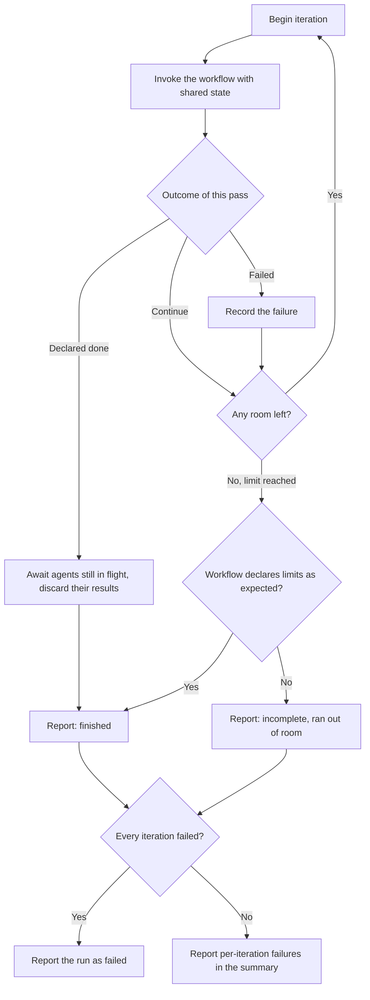
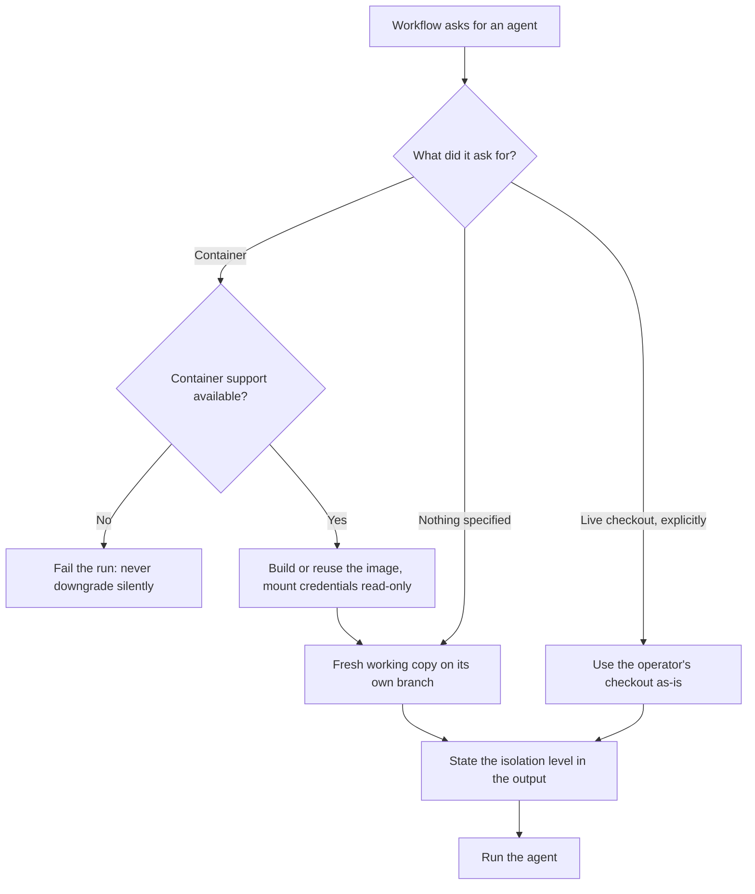
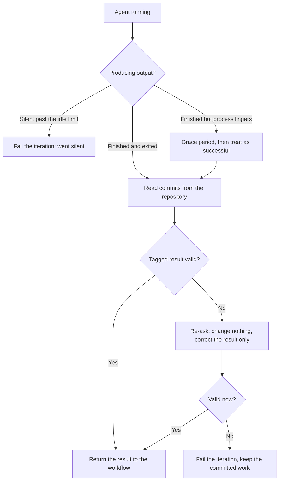
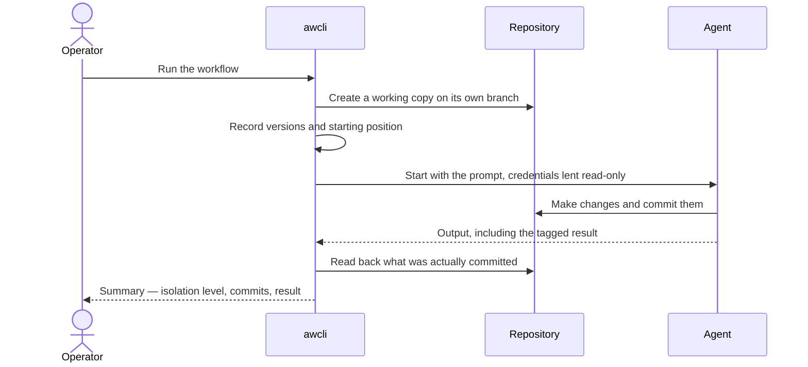
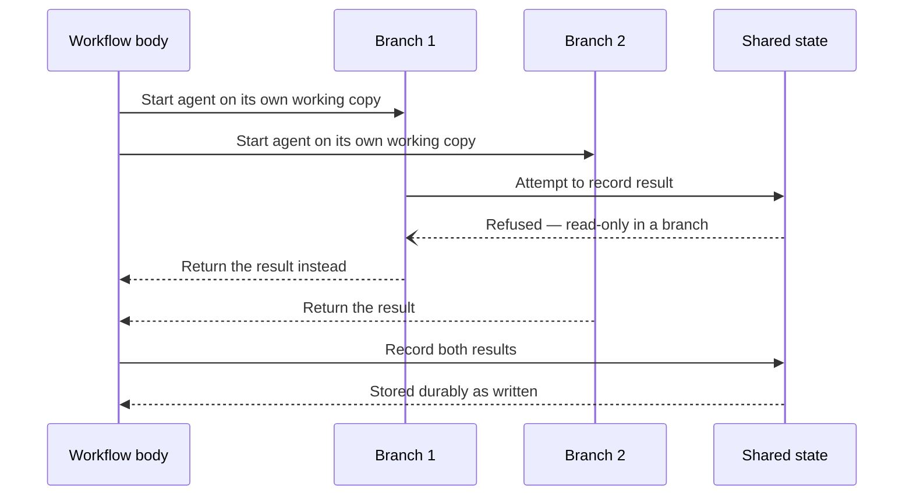
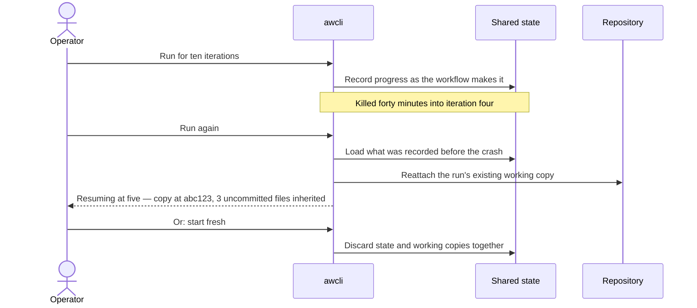

# awcli — Flow Diagrams

## Diagram Index

| Diagram | Covers rules | Covering scenarios |
|---|---|---|
| 1. Startup gates | BR-001…007, BR-009, BR-010, BR-035 | *Native Windows is refused*, *A directory that is not a repository*, *The repository's required version range*, *A workflow file with no usable entry point*, *A portable workflow meeting a repository that lacks a fact*, *Asking for tagged output the prompt never requests*, *Stored state no longer matching*, *Two runs of the same name cannot overlap* |
| 2. The iteration loop and how a run ends | BR-017…019, BR-037 | *The tool drives the loop*, *Finishing the work early*, *Exhausting the iterations*, *A monitor-style workflow declares*, *The time limit ends a run*, *One bad iteration does not end the night*, *A run where nothing succeeded* |
| 3. Choosing isolation for an agent | BR-004, BR-014, BR-015 | *A requested container is never silently downgraded*, *A workflow that asks for no container*, *The default protects my checkout*, *Working on the live checkout requires asking*, *Every agent call states how isolated it is* |
| 4. Getting a usable result out of an agent | BR-020, BR-022, BR-026 | *A malformed result is re-asked for*, *A result that stays malformed*, *An agent that goes silent*, *An agent that finished but has not exited*, *Detail that cannot be read degrades once* |
| 5. One agent call, end to end | BR-013, BR-014, BR-016, BR-025 | *Parallel agents never share a working copy*, *The default protects my checkout*, *Credentials are lent to a container*, *Every run can be explained the next morning* |
| 6. Fan-out and recording results | BR-012, BR-013, BR-028 | *A parallel branch may read shared state but not write it*, *The workflow body records results*, *Four agents at once stay readable* |
| 7. Crash and resume | BR-023, BR-024, BR-036 | *A crash mid-iteration*, *Resuming restores the work and says what it inherited*, *Starting fresh discards state and working copies together* |

---

## 1. Startup gates

Everything here happens before anything is created. The order matters: the cheapest, most certain
refusals come first, so an operator never waits on a container build to be told their platform is
unsupported.

## 2. The iteration loop and how a run ends

Four exits, and the workflow's own declaration decides whether running out of room counts as
finishing.

## 3. Choosing isolation for an agent

The default is chosen *for* the operator; weaker isolation is never chosen for them.

## 4. Getting a usable result out of an agent

The agent's committed work and the agent's *reported result* are separate concerns — which is why a
malformed result costs a decision, not the work.

---

## 5. One agent call, end to end

## 6. Fan-out and recording results

The permission boundary is visible here: branches return, the body records.

## 7. Crash and resume

